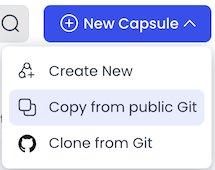

# Data Asset Creation for Pipeline Training

This Capsule runs a python script that uses the Code Ocean SDK to automatically create the following 3 Internal Data Assets and share them with everyone:
- Paired End Reads (8GB)
- Annotation File (1GB)
- STAR Index (28GB)

These Data Assets will be used during a Pipeline Training Session where users will build an RNA Seq Pipeline. This tutorial is also available in the [Code Ocean User Guide](https://docs.codeocean.com/user-guide/pipeline-guide/pipeline-tutorial). 

## Set up  
1. Create a New Capsule and choose the *Copy from public Git* option

2. Paste in the URL of this Capsule's Git repo: https://github.com/codeocean/pipeline-training-prep.git 

3. If using Code Ocean v2.22 or later, the environment should be configured automatically. If not, select a Python starter environment and add the `codeocean` package to pip. 

4. In your Account page, [create an Access Token](https://docs.codeocean.com/user-guide/code-ocean-api/authentication), save it as a *Custom Key* secret, and attach the secret to this capsule. 

5. Change the value of the `co_domain` variable on line 47 of `create_assets.py` to your Code Ocean domain.  

## Usage

You're all set, just click Reproducible Run!

[Code Ocean](https://codeocean.com/) brings together open-source tools and cloud technology to help Computational Scientists do great research.  
